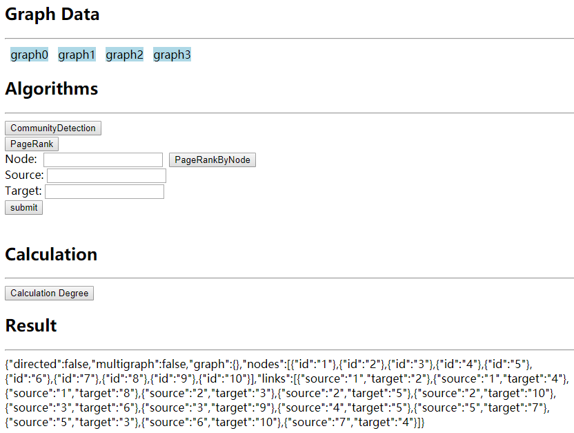

# The Computing Layer of ZheJiangLab Project

## Description

#### Complete Three Algorithms

- Community Detection
- Shortest Path
- Page Rank

## Install

`npm i`

`pip install -r requirements.txt`

## Start Project

`nodemon app.js`

## Usage

### Index UI

localhost:80 or 127.0.0.1:80 (Ugly but useful)



### api

|           路由            |  请求方式  |      参数      | 响应                                                         |
| :-----------------------: | :--------: | :------------: | :----------------------------------------------------------- |
|         get_data          | GET / POST |    dataName    | {'nodes':{...}, 'links':{...}}  //json, 返回graph数据。目前有graph0-3，位于data目录下。 |
| graph_community_detection |    GET     |       -        | {0:1,1:1}  //json, 反映每个节点属于哪个社团                  |
|      graph_page_rank      |    GET     |       -        | [('0',0.02),('1',0.01)] //根据pr大小排序，输出每个节点的pr，返回数组 |
|   graph_page_rank_node    | GET / POST |      node      | 0.002  // 只输出该node的PageRank值                           |
|    graph_shortest_path    | GET / POST | source, target | [‘1’,’3’,’2’]  //从source到target的一条最短路径              |
|     calculate_degree      |    GET     |       -        | {1:3,2:5} //返回每个节点的度                                 |

## Example

```javascript
$.ajax({
    url: 'get_data',
    type: "GET", // type: "POST"
    data: {
        dataName: graph2
    },
    // result 数据类型为json
    success: (result) => {
        // do something
    }
})
```

